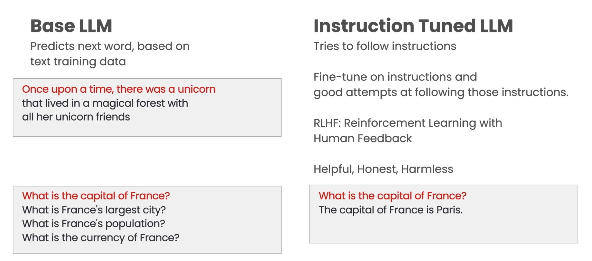

# ChatGPT Prompt Engineering Course - Study Notes
ChatGPT Prompt Engineering for Developers [DeepLearning.AI course link](https://learn.deeplearning.ai/chatgpt-prompt-eng)

## Table of Content

- [Introduction](#introduction)
- [Prompt Guidelines](#prompt-guidelines)
    - [Principle 1](#principle-1) Write clear and specific instructions
        - [Tactic 1](#tactic-1) - Use delimiters to clearly indicate distinct parts of the input
        - [Tactic 2](#tactic-2) - Ask for a structured output
        - [Tactic 3](#tactic-3) - Ask the model to check whether conditions are satisfied
        - [Tactic 4](#tactic-4) - "Few-shot" prompting
    - [Principle 2](#principle-2) Give the model time to “think”
        - [Tactic 1](#tactic-2-1) - Use delimiters to clearly indicate di

## Introduction

Two type of large language models (LLMs), one is `base LLM`, another one is `instruction tuned LLM`. This course is focusing on instruction tuned LLM.



## Prompt Guidelines

### Principle 1

`Write clear and specific instructions`

#### Tactic 1

`Use delimiters to clearly indicate distinct parts of the input`

Delimiters can be anything like: ```, """, < >, \<tag> \</tag>, prompt example:

```
Summarize the text delimited by triple backticks into a single sentence. 

```here is your content wrapped with delimiters```
```

`Clear and specific instructions` should be provided to guide a model towards the desired output, and `longer prompts` can provide `more clarity and context` for the model, `leading to more detailed` and relevant outputs.

#### Tactic 2

`Ask for a structured output`

Prompt example:
```
Generate a list of three made-up book titles along \ 
with their authors and genres. 
Provide them in JSON format with the following keys: 
book_id, title, author, genre.
```

Then you will get response below:

```
[
  {
    "book_id": 1,
    "title": "The Lost City of Zorath",
    "author": "Aria Blackwood",
    "genre": "Fantasy"
  },
  {
    "book_id": 2,
    "title": "The Last Survivors",
    "author": "Ethan Stone",
    "genre": "Science Fiction"
  },
  {
    "book_id": 3,
    "title": "The Secret Life of Bees",
    "author": "Lila Rose",
    "genre": "Romance"
  }
]
```
#### Tactic 3
`Ask the model to check whether conditions are satisfied`

Try 
```
text_1 = f"""
Making a cup of tea is easy! First, you need to get some \ 
water boiling. While that's happening, \ 
grab a cup and put a tea bag in it. Once the water is \ 
hot enough, just pour it over the tea bag. \ 
Let it sit for a bit so the tea can steep. After a \ 
few minutes, take out the tea bag. If you \ 
like, you can add some sugar or milk to taste. \ 
And that's it! You've got yourself a delicious \ 
cup of tea to enjoy.
"""
prompt = f"""
You will be provided with text delimited by triple quotes. 
If it contains a sequence of instructions, \ 
re-write those instructions in the following format:

Step 1 - ...
Step 2 - …
…
Step N - …

If the text does not contain a sequence of instructions, \ 
then simply write \"No steps provided.\"

\"\"\"{text_1}\"\"\"
"""
response = get_completion(prompt)
print("Completion for Text 1:")
print(response)
```

and

```
text_2 = f"""
The sun is shining brightly today, and the birds are \
singing. It's a beautiful day to go for a \ 
walk in the park. The flowers are blooming, and the \ 
trees are swaying gently in the breeze. People \ 
are out and about, enjoying the lovely weather. \ 
Some are having picnics, while others are playing \ 
games or simply relaxing on the grass. It's a \ 
perfect day to spend time outdoors and appreciate the \ 
beauty of nature.
"""
prompt = f"""
You will be provided with text delimited by triple quotes. 
If it contains a sequence of instructions, \ 
re-write those instructions in the following format:

Step 1 - ...
Step 2 - …
…
Step N - …

If the text does not contain a sequence of instructions, \ 
then simply write \"No steps provided.\"

\"\"\"{text_2}\"\"\"
"""
response = get_completion(prompt)
print("Completion for Text 2:")
print(response)
```

Interestingly, it gives me the steps if I only ask the second question, but once I ask the first question, it says "No steps provided." for the second question.

#### Tactic 4

`"Few-shot" prompting`

>In contrast to traditional deep learning models that require a large amount of data to learn, few-shot learning aims to enable models to learn from limited data, which is more similar to how humans learn.

```
prompt = f"""
Your task is to answer in a consistent style.

<child>: Teach me about patience.

<grandparent>: The river that carves the deepest \ 
valley flows from a modest spring; the \ 
grandest symphony originates from a single note; \ 
the most intricate tapestry begins with a solitary thread.

<child>: Teach me about resilience.
"""
response = get_completion(prompt)
print(response)

# response:
<grandparent>: Resilience is like a tree that bends with the wind but never breaks. It is the ability to bounce back from adversity and keep moving forward, even when things get tough. Just like a tree that grows stronger with each storm it weathers, resilience is a quality that can be developed and strengthened over time.
```

### Principle 2
`Give the model time to “think”`

#### Tactic 2-1
`Specify the steps required to complete a task`

```
prompt_1 = f"""
Perform the following actions: 
1 - Summarize the following text delimited by triple \
backticks with 1 sentence.
2 - Translate the summary into Chinese.
3 - List each name in the Chinese summary.
4 - Output a json object that contains the following \
keys: chinese_summary, num_names.

Separate your answers with line breaks.

Text:
```{text}```
"""
```
